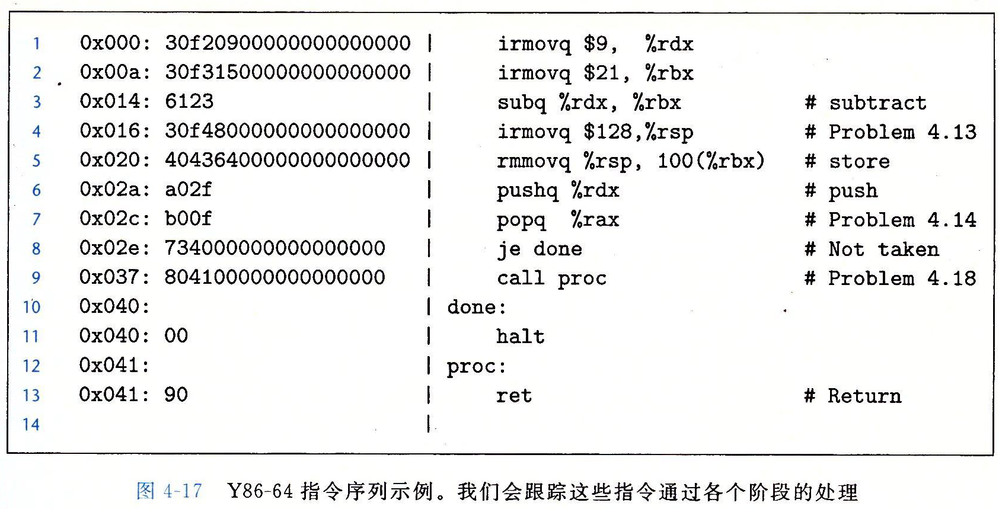

# 4 处理器体系结构

## 笔记

图4-20

popq有点错误，访存阶段读出的值应该是valM。这是栈顶的要pop出来的值。     
译码阶段，pushq和popq都需要读出栈指针寄存器rsp的值，pushq还需要从寄存器中读出要push进栈的值。   
执行阶段，计算出新的栈指针值。  
访存阶段，pushq向新的栈顶写入值，popq从老的栈顶读出值。  
写回阶段，pushq更新栈指针，popq将访存阶段读出的栈顶值写入目标寄存器和更新栈指针。   
注意这里，栈指针的更新都是在内存操作后完成的。

## 习题

4.13

图4-17:

irmovq是一条传送指令，将立即数存到寄存器里。具体的编码参考：

Y86-64所有指令
答案：  
|阶段|操作|
|---|---|
|取指|icode:ifun $\leftarrow$ $M_1$[PC] = $M_1$[0x016] = 3:0 第一个字节存操作码 rA:rB $\leftarrow$ $M_1$[PC+1] = $M_1$[0x017] = f:4 第二个字节存寄存器编号 valC $\leftarrow$ $M_8$[PC+2] = $M_8$[0x018] = 00000000 00000080 = 8 $\times$ 16 = 128 高八字节存立即数，因为是小端存储，所以80是在低位 valP $\leftarrow$ PC + 10 = 0x20 这条指令是10字节长，PC+10|
|译码|第一个操作数是立即数，不需要取第二个寄存器操作数，所以该指令在译码阶段什么都不做|
|执行|valE $\leftarrow$ 0 + valC = 128|
|访存||
|写回|R[rB] $\leftarrow$ valE = 128|
|更新PC|PC $\leftarrow$ valP = 0x20|
